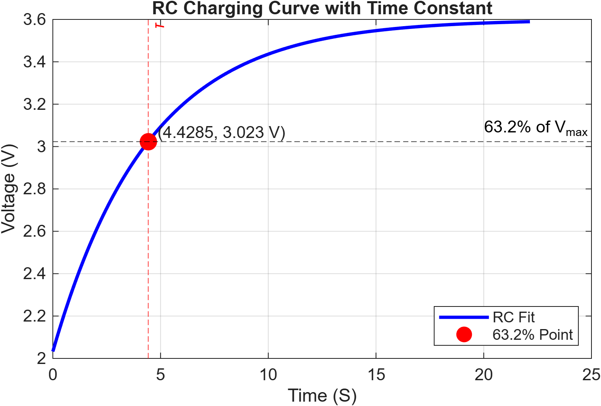
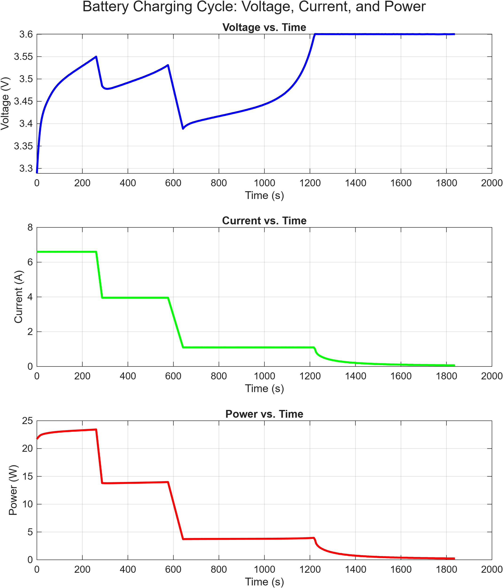
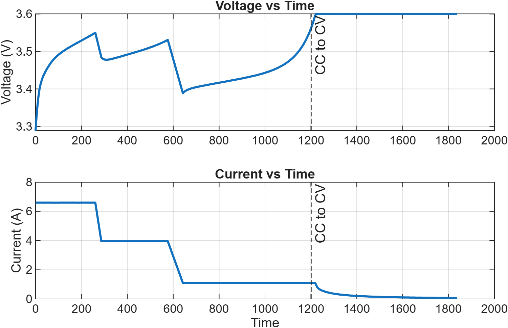
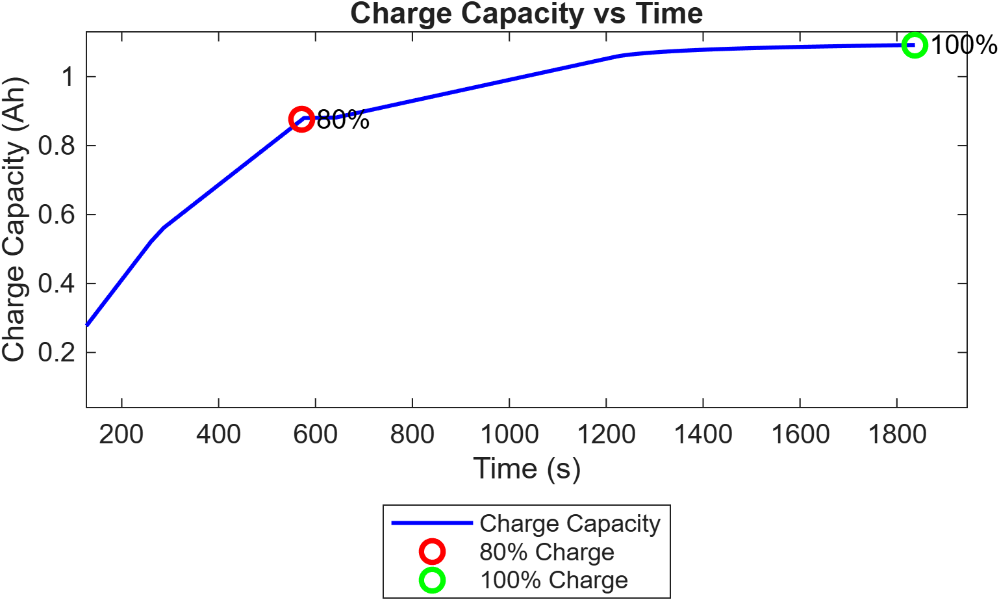
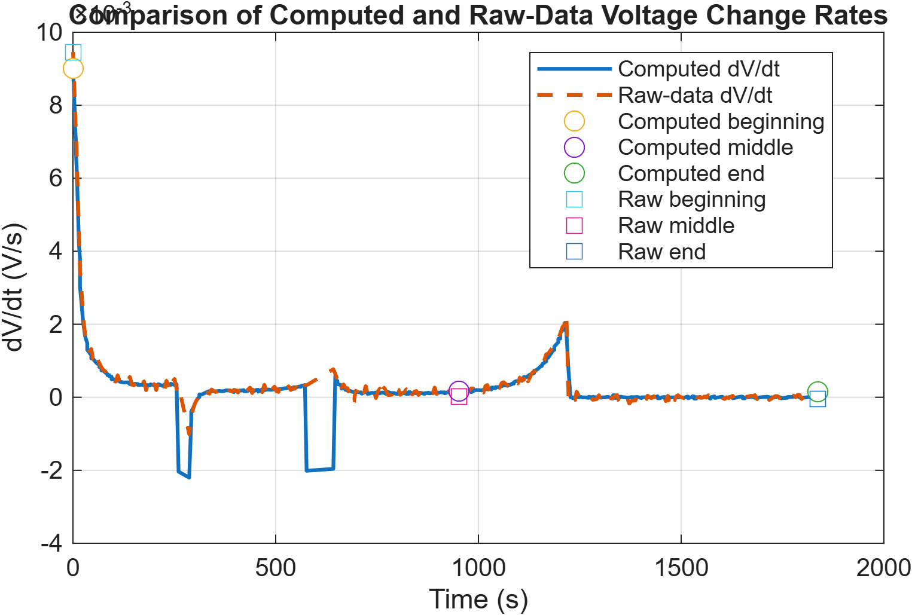
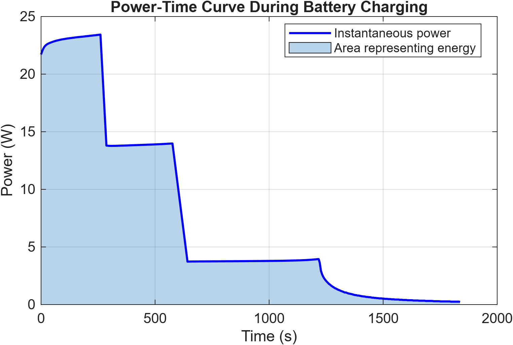
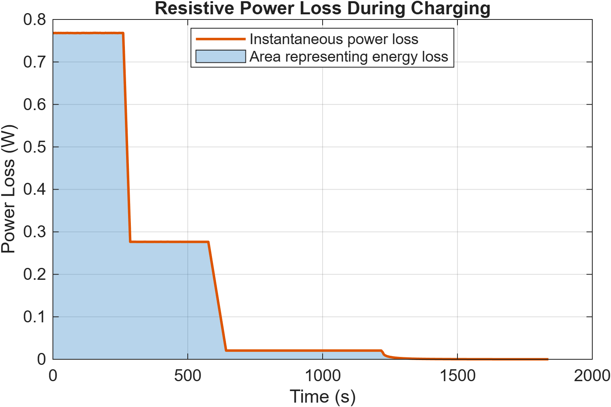

# batterycharging_team8
**Description**
This MATLAB project is the proposed solution to [modeling a battery charging circuit with RC circuit](https://github.com/mathworks/MATLAB-Simulink-Challenge-Project-Hub/tree/main/Classroom%20Challenge%20Projects/Projects/Modeling%20and%20Analyzing%20a%20Battery%20Charging%20Profile). It includes plots and analysis of energy loss, and performance using real-world voltage data. By fitting the standard capacitor charging equation *V(t) = V<sub>max</sub>(1 - e<sup>-t/RC</sup>)* to the real dataset, we aim to explain the charging behavior, accompanying the goodness-of-fit statistics for this RC circuit approximation and CC/CV charging region.

## How to Run
[```code```](https://github.com/Lisethmc00/batterycharging_team8/tree/main/MATLAB_CODE)\
The MATLAB live scripts include the analysis and plots. Please download the folder and run the ```BATTERYCHARGING_TEAM8_FINALVERSION.mlx``` file, the ```CREATE_RC_CURVE.m``` must be in the same path.\
Additionally, the code relies on the MATLAB packages: Predictive Maintenance toolbox and the Curve Fitting toolbox, which needs to be installed.

## Methodologies
Using the fitted RC model, we aim to:\
**Plot** Voltage vs. time, Current vs. time, Power vs. time\
**Analyze** the rate of change of voltage at different stages of charging\
**Compute** the time required to 80% and to reach 100% of the maximum voltage\
**Estimate** the power lost due to series resistance P = IV = I<sup>2</sup>R\
**Calculate** and estimate the total energy delivered to the battery using integration under the Power vs. time curve

## Data
The data is fetched from the MATLAB internal files ```batteryagingdata/singlecell/v1/singleCellLifeTimeData.zip```.\
Temperature chamber is at 30 degrees Celsius. Single cell that is cycled to failure （80% state of health） in order to provide a comprehensive view of its performance over time. The cycling sequence exercises the battery cell with dynamic fast charging and constant 4C discharging. In each cycle, the battery is fully charged until it reaches 3.6V and fully discharged when it reaches 2V.\
The analysis will be focused on the first charging cycle.

## Model Data Fit
This code section plots the charging voltage response of a simple RC circuit across a 2000seconds window based on a defined input for maximum voltage V<sub>max</sub>, R, and C. Using the standard exponential charging formula *V(t) = V<sub>max</sub>(1 - e<sup>-t/tau</sup>)*, it produces a curve showing the voltage approaching its maximum at about 3.6v from 2v for the first charging cycle of the battery.\
*tau = RC* is the time constant of the RC circuit *time it takes to reach 63.2% of the maximum voltage which is 3.6v*, together with time *t*, were the two parameters used to fit the voltage data.\
Using the MATLAB function ```[fitobject,gof]=fit(x,y,fite,fitOptions)```, *tau* is determined to 4.429seconds.
\
Current decreasing as voltage rises, and power as the product of voltage and current trends similar to that of the graph for current.\
\
Analyzing the goodness of fit statistics using the ```gof``` command, the fit yields a r-squared value of 0.729, which is good indicator of the correlation in the data, the error can partly to attributed to the regions of CC and CV phase.\
For a standard Li-ion battery, it is typically charged using a Constant Current **CC** phase, where the charger supplies a fixed current until the battery voltage almost reaches its maximum charge voltage. It then switches to Constant Voltage **CV** mode, holding that voltage constant while the charging current gradually decreases, ending the charge when the current falls below a preset threshold. Here is the graph for voltage and current vs time, displaying the CC to CV phase shift.\
\
The battery charges quickly at first while protecting it from overvoltage and excessive temperature from the inrush current, improving safety and battery lifespan. This process is usually controlled by a battery management system, which continuously monitors the battery's voltage and current.\
The behavior of a RC circuit during charging would predict that for a capacitor, the current is proportional to the rate of the change of the voltage by a constant *C*.\
*i = C dv/dt*\
Because the capacitor acts a short circuit when uncharged, the current flow is maximum at the beginning, although controlled, we can still see the voltage climbing in an ideal fashion, before about 250seconds.\
The current then gradually steps down to prevent overheating the battery as excessive current creates power loss. When the capacitor's voltage almost reaches the supply voltage, the charging profile changes to CV, where a standard RC charging circuit is clearly present; as the voltage tops near the maximum voltage, the current drops exponentially similar to that of the ideal model for current.

## Charge capacity over time
\
We see how the battery is most efficiently charged for the first 80%.
It takes about 9 minutes to charge 80% and then takes an additional 21 minutes to charge to 100%.\
Previously we saw how the battery changes from CC to CV at about t = 20 minutes. This is reasonably expected because as the voltage approaches the battery maximum voltage, the charging exponentially tips off.

## Rate of Change at Key Intervals
We computed the rate of the change of voltage with respect to time ```dVdt= gradient(voltage, time)```, we expect to see the derivative of voltage vs time to resembles a form more or less like that of the current.\
\
Initially, the voltage climb similar to that of RC model would predicts, and we can see dv/dt exponentially dips. Then the two steep negative slopes where the current abruptly drops in the constant current phase are clearly present; the voltage is controlled to be lowered causing the current to decrease accordingly. And evidently, during the constant current phase, the rate of change of current is mostly zero, aligning with what a RC model would predict. Eventually, the constant voltage phase began at about 20 minutes in, which cause the current to increase exponentially, and thus a positive value for dv/dt.

## Power Delivered to the Battery
The instantaneous power tells us how fast electrical energy is being delivered to the battery at each moment during the charging process.
Power is:\
            *P(t) = V(t)I(t)*\
With *dE / dt = P(t)* the total energy delivered is the integral\
\
This aligns with how the battery is most efficiently charged for the first 80% of the charge. We can see how the battery, during constant current phase, delivers the most power, and the exponentially decaying region is constant voltage took place.

## Power Loss due to Resistance
Apply Joule's Law:\
  With Ohm's law *V = IR*\
  The heating formula estimating power loss in watts is given as:\
       *P<sub>loss</sub> = IV = I<sup>2</sup>R*\
The Energy loss is given as:\
       *E<sub>loss</sub> = P<sub>loss</sub>t*\
\
The resistive power loss is split into three sections, as the power loss is scaled quadratically with current **I**, by lowering current, we can improve the energy efficiency by not only linearly but would also double the charging time during the CC phase.\
Alternatively, a higher maximum battery voltage allows the same charging power to be delivered with lower current, reducing resistive losses and heat in the cables and electronics.

## Summary
Originally, we considered V<sub>0</sub> to be zero as expected of off a standard ideal RC charging circuit, which had led to a huge peak at the initial time. After fixing the mistake, we produced much more reasonable plot for dv/dt and improved our r-squared value for the fitted voltage plot from 0.229 to 0.729.
We have not yet explored the impact of recycling usage of the Li-ion battery across multiple charging and discharging cycles. However, most importantly, the RC model alone can predict the constant voltage phase neatly but struggles a little to predict the constant current phase as the voltage is manually controlled.\
More advanced analytics using MATLAB can be intergraded into the battery management system that learns the specifics of the battery across cycles and makes more beneficial decisions on the exact value used in CC phase, and to monitor the battery health and degradation over time.


